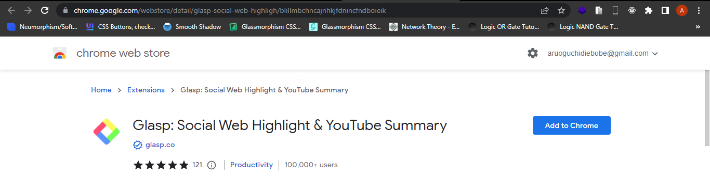
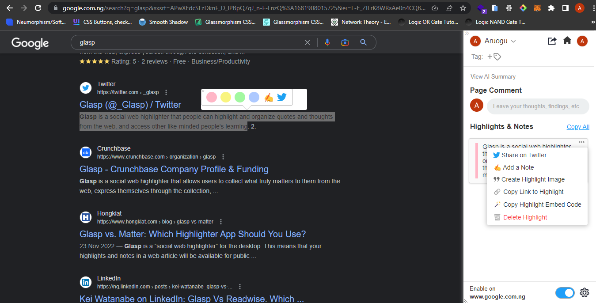
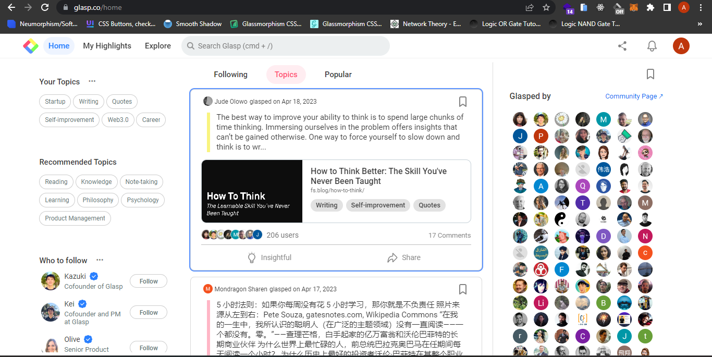
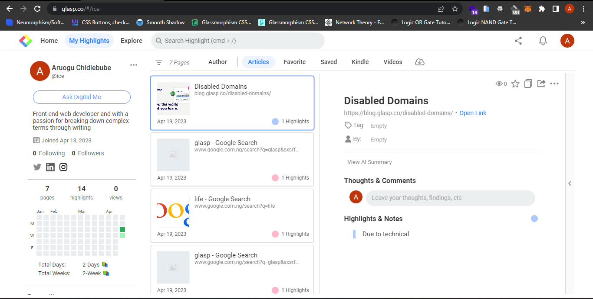
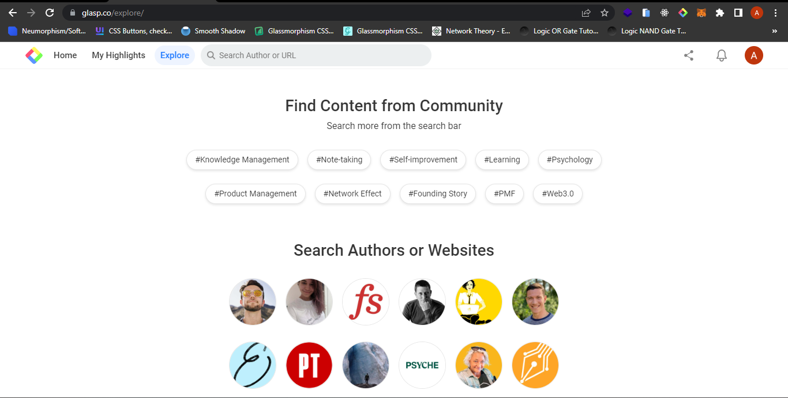

<!--  -->
<!-- # GLASP: THE WEB HIGHLIGHTER 📚 ✨ -->

Have you ever found an interesting line while reading an article on the web and wished it was a note so you can highlight it?. Imagine having a web highlighter that helps you to highlight your striking phrases, add notes to it and carefully arranges your favorite lines and phrases for you!. 

This article introduces the concept of Glasp, its features and how to make the most out of Glasp extension. We will look at the article under the following subheadings. 

  [1. What is Glasp](#1-what-is-glasp)

  [2. Who can use Glasp](#2-who-can-use-glasp)

  [3. Adding Glasp extension](#3-adding-glasp-extension)

  [4. What's special about Glasp](#4-whats-special-about-glasp)

  [5. Glasp at a glance](#5-glasp-at-a-glance)

  [6. Conclusion](#6-conclusion)

## 1. What is Glasp

Glasp is a free web browser extension and a social web highlighter that facilitates reading, writing and sharing knowledge. Just as your normal highlighter, Glasp helps you to highlight striking phrases, words and sentences and make quick notes as you browse the web. This feature enables easy referencing while studying. Glasp, the Greatest Legacy Accumulated as Shared Proof  helps you leave digital footprints in the digital world. You can impact people through reading and become an influencer through your research. 
All you have to do is highlight - save- share - repeat.

## 2. Who can use Glasp

 Anyone that seeks to develop oneself through knowledge will find Glasp very insightful. Glasp is designed to suite anyone from writers to readers.

## 3. Adding Glasp extension

Since Glasp is a web browser extension, it can be installed on Chrome or Safari. In this article, I’ll guide you on how to install Glasp on Chrome. However, you can follow through to know the features of Glasp despite the web browser you’re using. 

  1. Go to Chrome web store, search for [Glasp](https://chrome.google.com/webstore/detail/glasp-social-web-highligh/blillmbchncajnhkjfdnincfndboieik)
    

  2. Click on **Add to Chrome** and add the extension to your web browser.
   
  3. Pin Glasp to your toolbar by clicking on the **Extension icon > Pin icon**. 
   
  4. Click on the **Extension icon** to sign up with your google account.
   
  5. You'll be prompted to choose from a range of topics while setting up. Pick topics that you're interested in and wish to learn from like-minds.
   
  6. Welcome to Glasp 📚 ✨.

## 4. What's special about Glasp

Let's take a look at how we can use Glasp while researching and some of the cool features Glasp has to offer.  
To open Glasp in your web page, Click on the **Glasp Extension icon** in your tool bar. 

- Highlight and add notes 

  You can only highlight notes from a web page. Highlight a text on the web and choose from a list of colors in the pop-up color bar. You can also add a note or share on twitter.  Highlighted texts from the web page is displayed in the sidebar. 

- Paste into note apps

  Glasp enables you to copy your notes to your note app in Markdown. Click the link **Copy All** to copy all contents from the sidebar into your note app.

- Share your learning, impact others
  
  Glasp pays attention to sharing knowledge amongst like-minds. Click on the **Share icon** in the tool bar to share your highlights and impact the world. 

- Learn from like-minds. Learning never ends
  
  Glasp has a fast growing community of Glaspers who contribute daily to Glasp through their research, notes and highlights. Click on the **down arrow** in the top bar to see who else has highlighted on this web page. Increase your knowledge!. 

- Quoteshots

  Effortlessly turn your highlight into a quote. Hover over a highlighted content in the sidebar and select **Create Highlight Image**. 

- Comments
  Leave comments, thoughts, findings about a web page. 
  
- Tags
  
  Organize your highlights based on custom tags.

- AI summary

  Click on **View AI Summary** in the sidebar to get an AI summary of all your highlighted contents from a web page.

- Embed in blog

  Glasp also helps you to easily embed your research in your blog. Click on **Copy Highlight Embed Code** to get the code and embed in your blog. 

- Toggle the button below the sidebar to disable or enable Glasp on a particular web page. 
  
## 5. Glasp at a glance

  Let's take a walkthrough our Glasp user profile. Click on the user icon or the home icon on the top-right corner. This opens a web page with Home, My Highlights and Explore tab. We will look into these tabs in details. 

- Home Tab 

  

  This page has a lot of great contents, so we will digest them one column at a time. 

    - You can see your chosen topics from **Your Topics**.

    - Glasp algorithm helps you to choose from a list of **recommended topics** to learn from.
  
    - Glasp recommends like-minds for you to follow and learn from in **Who to follow**.
  
    - **Following tab** filters highlights based on who you're following.
  
    - **Topics tab** filters highlights based on Your topics.

    - **Popular tab** filters highlights in Glasp that have gained interaction amongst various people. 

    - **The community page** shows you how many people have highlights based on the active highlight. You can click on **Community Page** link to connect with like-minds. 
  
- My highlights Tab
  
  

    - You can edit your profile by clicking the **three dot menu** beside your name.
   
    - **Ask Digital Me** any question based on your highlights. 
  
    - Glasp provides a calender plugin to enable you organize your glasp according to days and weeks. 
  
    - Your articles are filtered by author, articles, favorite, saved, kindle and youtube videos.
  
    - Download highlights and notes in .txt, .md, or .csv formats.

- Explore Tab
  
  

  Connect with Glaspers from the community and increase your knowledge graph. You can search for a related glasper author or a URL to see other's thoughts on that web page. 
  
## 6. Conclusion

Glasp features makes reading, learning and writing fun and easy. Become a Glasper today!, and increase your knowledge intake. 